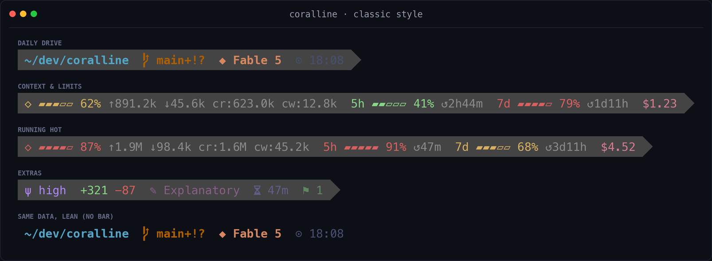
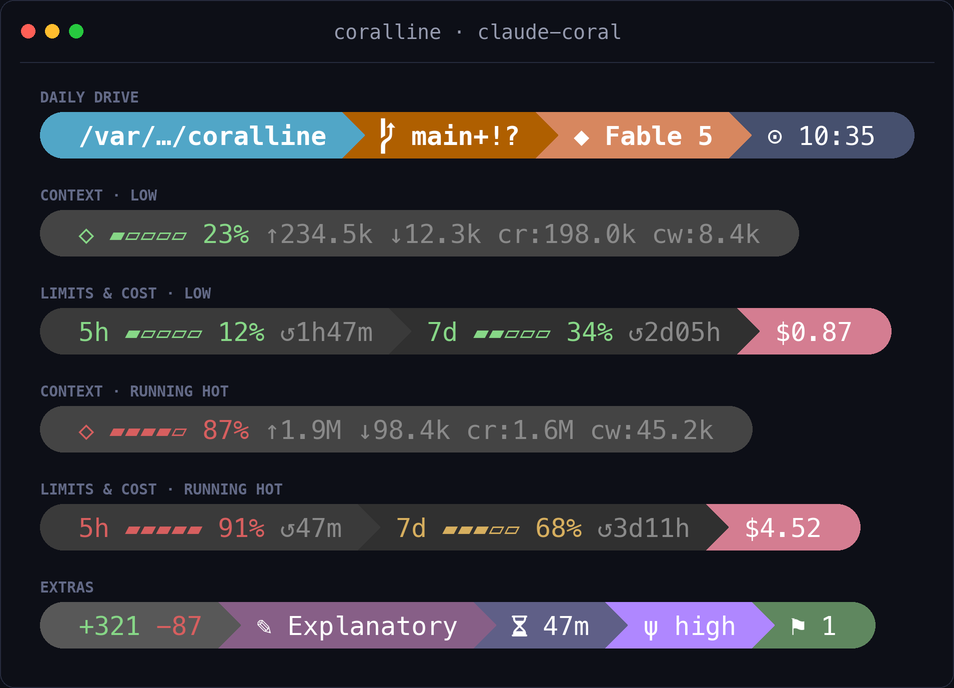
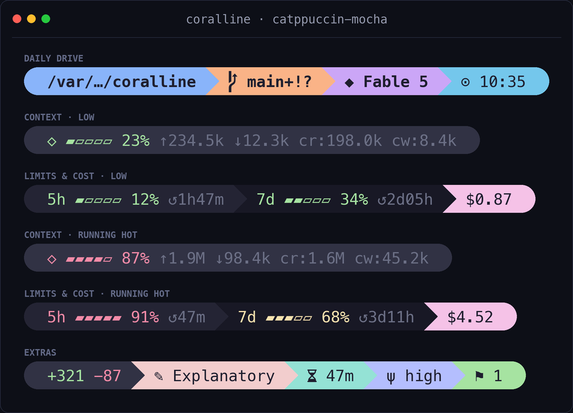
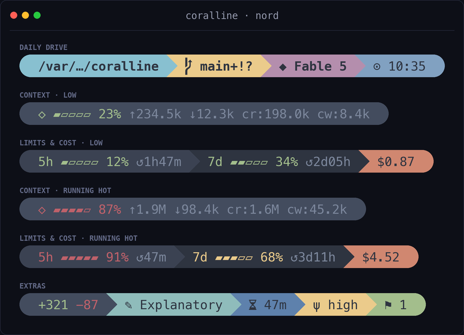
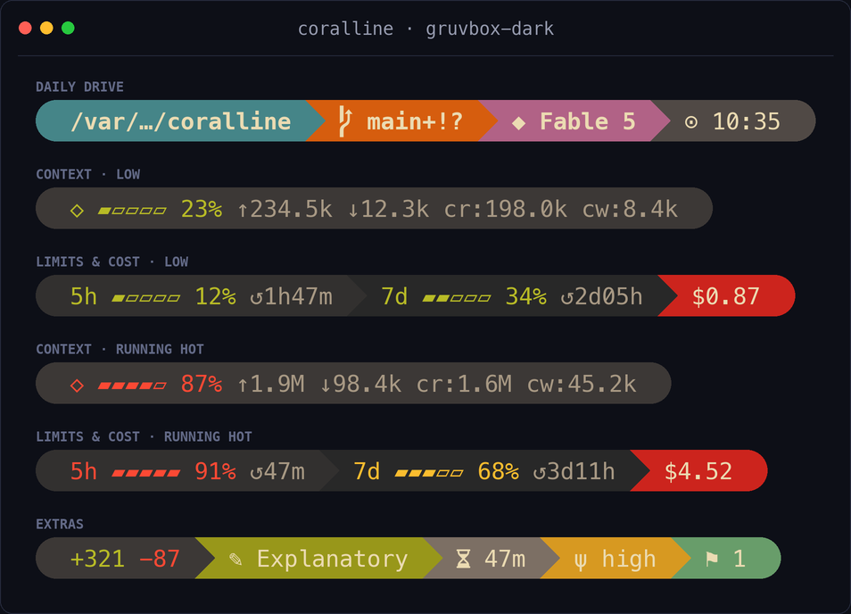
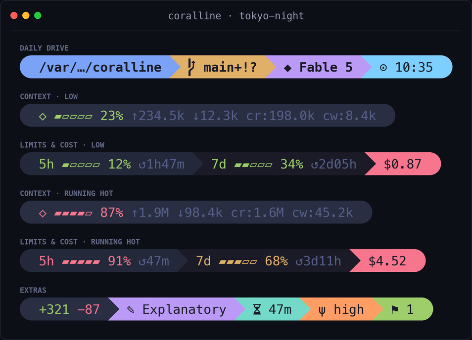
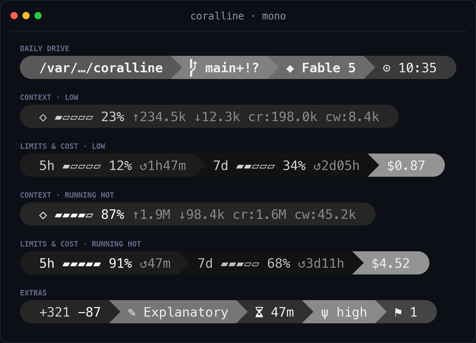
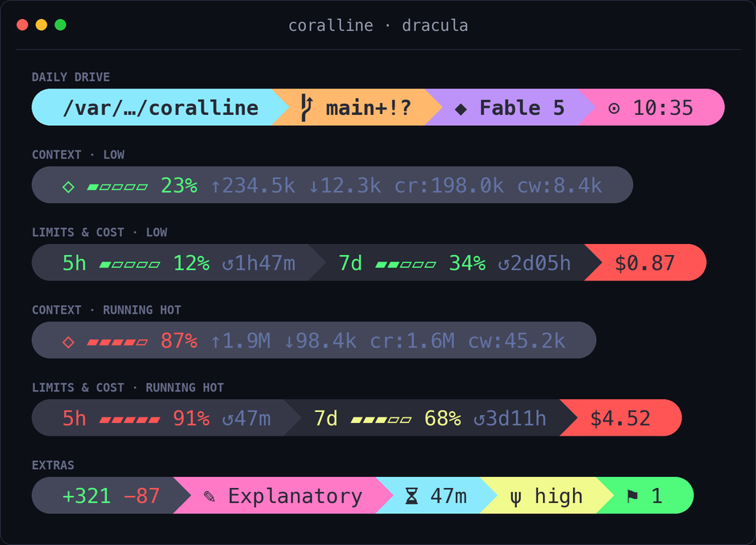
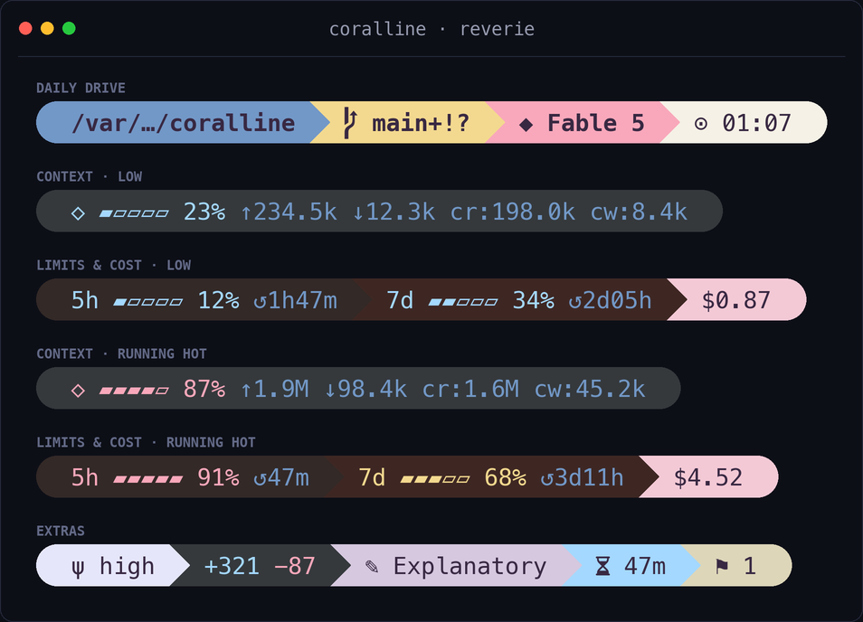

# coralline

> 給 Claude Code 用、向 [Powerlevel10k](https://github.com/romkatv/powerlevel10k) 致敬的
> statusline，特色是人類與 AI 共用同一個 installer 入口：你可以直接跑，也可以交給
> Claude 幫你跑完設定。

[English README](./README.md)


## 效果

```text
╭ ~/side-project/coralline  ⬢ coralline  ⎇ main+!  ◆ Fable 5  ψ high  ⬡ ▰▰▰▱▱ 62% ↑1.2M ↓45.6k  5h ▰▰▱▱▱ 41% ↺2h44m  7d ▰▰▰▰▱ 79% ↺1d11h  +321 −87  $1.23  ✎ Explanatory  ⧖ 47m  ⚑ 1  ⊙ 02:45 pm ╮
```

| 區段 | 顯示內容 |
|---|---|
| `dir` | 目前目錄，過長路徑摺疊為 `~/a/…/z` |
| `project` | repo 名稱（`⬢`），在所有 worktree 都相同；非 git repo 時隱藏 |
| `git` | 分支、已暫存 `+` / 已修改 `!` / 未追蹤 `?`、領先 `⇡` 落後 `⇣` |
| `node` | 目前 Node 版本（Nerd Font `nf-dev-nodejs_small`），來自 `.nvmrc` / `.node-version`（或以 `VL_RUNTIME_PROBE=1` 讀取 `PATH` 上的 `node`）；偵測不到時隱藏；需手動開啟 |
| `python` | 目前 Python 環境（Nerd Font `nf-dev-python`）—— `$VIRTUAL_ENV` / conda（略過 `base`）/ `.python-version`（或以 `VL_RUNTIME_PROBE=1` 讀取 `PATH` 上的 `python3`）；偵測不到時隱藏；需手動開啟 |
| `model` | 目前使用的 Claude 模型 |
| `effort` | 推理強度（`ψ`）—— `low` / `med` / `high` / `xhigh` / `max` |
| `ctx` | context window 量表、輸入/輸出/快取 token 數 |
| `limit5h` / `limit7d` | 用量限額量表與重置倒數 |
| `burn` | 消耗時間預估：根據最近燒耗率推算，何時會達到限額上限（5h 或 7d）100%（`↗`）；把 `burn` 加入 `VL_SEGMENTS` 啟用 |
| `lines` | 本次 session 修改行數 |
| `cost` | 本次 session 花費（USD） |
| `style` | 目前的 output style |
| `duration` | session 經過時間 |
| `stash` | git stash 數量 |
| `clock` | 時鐘，12 或 24 小時制 |

量表會隨用量變色：綠色 → 50% 轉黃 → 75% 轉紅（門檻可調）。

## 安裝

三種安裝方式都由同一支 `install.sh` 驅動，每一種都會把 renderer **與設定 wizard** 複製到
`~/.claude/coralline`、並把 statusline 註冊進 Claude Code，所以不管你用哪種方式裝，之後都能重跑 wizard。

> **需求：** `jq` 以及 [Nerd Font](https://www.nerdfonts.com/) 終端機字型。
> 沒有 Nerd Font 的話，在設定檔加上 `VL_ASCII=1` 改用無特殊字符的渲染。

### 請 Claude 安裝（推薦）

把這段貼進 Claude Code：

```text
Please install coralline for me:
fetch https://raw.githubusercontent.com/Nanako0129/coralline/main/INSTALL.md
and follow the playbook in it.
```

Claude 會先讀 playbook，再用同一支 installer bootstrap runtime、訪談你的外觀偏好、
寫入設定並驗證，最後提醒你如果不滿意可以自己重新開啟視覺化 wizard。

如果你的 Claude 對這份 playbook 亮紅旗、想先檢查內容，那是正確的直覺而不是阻礙：
見[信任與安全](#信任與安全)。

### 自己安裝

在終端機執行：

```bash
curl -fsSL https://raw.githubusercontent.com/Nanako0129/coralline/main/install.sh | bash
```

互動執行時會詢問要裝哪個版本 —— 最新的 release tag（建議）或 `main`（最新開發版）。
想略過詢問就用 `--ref` 直接指定，例如 `... | bash -s -- --ref v0.6.0` 或 `--ref main`。

### 手動安裝

```bash
git clone https://github.com/Nanako0129/coralline ~/.claude/coralline-src
mkdir -p ~/.claude/coralline/themes
cp ~/.claude/coralline-src/statusline.sh ~/.claude/coralline/
cp ~/.claude/coralline-src/configure.sh ~/.claude/coralline/
cp ~/.claude/coralline-src/install.sh ~/.claude/coralline/
cp ~/.claude/coralline-src/themes/claude-coral.conf ~/.claude/coralline/themes/
```

接著在 `~/.claude/settings.json` 加入：

```json
{
  "statusLine": {
    "type": "command",
    "command": "bash ~/.claude/coralline/statusline.sh",
    "refreshInterval": 1
  }
}
```

> **注意：** 上面的指令只複製 `claude-coral` 一個主題。「請 Claude 安裝」與一行安裝會帶上全部主題；
> 手動安裝後若要換主題，把 `~/.claude/coralline-src/themes/*.conf` 其餘的也複製進 `~/.claude/coralline/themes/`。

### 更新

兩種更新方式，都由同一支 installer 驅動。無論哪種，你的 `~/.claude/coralline.conf`
都會被保留，舊的 `statusline.sh` 會備份在 `~/.claude/coralline/` 下（保留最近 3 份）。

#### 請 Claude 更新（推薦）

把這段貼進 Claude Code：

```text
Please update coralline for me:
fetch https://raw.githubusercontent.com/Nanako0129/coralline/main/UPGRADE.md
and follow the playbook in it.
```

Claude 會重跑 installer、讀取「new since your installed copy」報告，並主動問你要不要開啟新出現的 opt-in 功能。

#### 自己更新

重跑 installer —— 有新東西時它會印出一段簡短的「new since your installed copy」報告：

```bash
curl -fsSL https://raw.githubusercontent.com/Nanako0129/coralline/main/install.sh | bash -s -- --install-only
```

## 信任與安全

「請 Claude 安裝」本質上是一份遠端文件，指示 AI 執行 `curl | bash` 並修改
`~/.claude/settings.json`。這個形狀和 prompt-injection 攻擊一模一樣，所以你的 Claude
如果先亮紅旗、要求檢查，那是它運作正常，不是故障。回應這種懷疑的方式是檢驗，不是信任：

- **先讀會執行的東西。** 全部都在這個 repo 裡：[install.sh](./install.sh)（約 270 行）
  只做複製檔案和合併一個 `statusLine` key 到 `settings.json`；[INSTALL.md](./INSTALL.md)
  是 AI 遵循的 playbook。讓你的 Claude 先讀完這兩份再請求核可，這是預期流程。
- **釘選版本。** `... | bash -s -- --ref v0.6.0` 安裝打過 tag 的 release 而非 `main`，
  你審過的就是你跑的。互動式安裝本來就預設建議最新 tag。
- **確切會寫入什麼：** `~/.claude/coralline/` 底下的檔案、你的選擇存在
  `~/.claude/coralline.conf`、以及合併進 `~/.claude/settings.json` 的一個 `statusLine`
  設定（合併前會先建立帶時間戳的 `settings.json.bak.*` 備份）。僅此而已。
- **裝完之後跑的是什麼：** `statusline.sh` 在每次 prompt 時渲染。純 bash、執行期零網路
  請求；每次渲染唯一的外部指令是一個 `jq` 和一個 `git` 呼叫。你的對話、金鑰、用量資料
  不會離開這台機器。
- **INSTALL.md 為什麼對 AI 說話：** 人類走視覺化精靈、AI 走訪談腳本，所以 playbook 對
  「實際執行它的讀者」說話。一份開頭就對你的 AI 下指令的文件本來就該被檢視，這正是它
  引用的每個檔案都放在這個 repo、讓你們倆都能先讀的原因。

### 移除

```bash
rm -rf ~/.claude/coralline ~/.claude/coralline.conf
```

然後把 `~/.claude/settings.json` 裡的 `statusLine` 區塊刪掉（或還原最新的
`settings.json.bak.*`）。不會留下其他任何東西。

## 設定

兩種方式都使用同一支 installer。人類不帶模式參數執行時會進入視覺化設定；
Claude 則使用 `--install-only` bootstrap，接著依照 `INSTALL.md` 訪談並寫入設定。

### 設定模式

| 模式 | 適合情境 |
|---|---|
| 預設 | 想直接使用 coralline 預設外觀 |
| Powerlevel10k import | 已經有 `~/.p10k.zsh`，想帶入 style、時間格式與主要色彩 |
| 視覺化 wizard | 想先預覽 theme、style、segments、折行、時鐘與字型相容性 |

自己直接執行 installer、不帶模式參數時，會開啟互動式設定。除非你明確要求視覺化自訂，
Claude 不需要操作這個人類 TUI。

### 重新設定

每一種安裝方式都會把 wizard 複製到 `~/.claude/coralline`，所以你隨時可以重跑來重新調整外觀：

```bash
bash ~/.claude/coralline/configure.sh
```

### 測試 fork

讓 installer 指向同一個 fork：

```bash
curl -fsSL https://raw.githubusercontent.com/YOU/coralline/main/install.sh | bash -s -- --repo YOU/coralline
```

## 設定檔

所有設定都在 `~/.claude/coralline.conf`（純 bash，由腳本 source 進來）：

| 變數 | 預設值 | 說明 |
|---|---|---|
| `VL_STYLE` | `pill` | `pill`：powerline 膠囊 · `lean`：純色文字 · `classic`：文字鋪在統一深色橫條上(p10k classic) |
| `VL_LAYOUT` | `fixed` | `fixed`：每個 `VL_SEGMENTS*` 變數固定一行 · `auto`：響應式 |
| `VL_MAX_LINES` | `3` | 僅 `auto`——最多折成幾行（`1` = 永不折行） |
| `VL_WRAP_MARGIN` | `4` | 僅 `auto`——右側預留的欄數，避免 segment 貼到視窗邊緣 |
| `VL_SEGMENTS` | `dir git model ctx limit5h limit7d cost clock` | 第一行的區段與順序（`auto` 模式下為完整清單） |
| `VL_SEGMENTS2` / `VL_SEGMENTS3` | （空） | 僅 `fixed`——可選的第二、三行 |
| `VL_CLOCK` | `12h` | `12h` / `24h` / `off` |
| `VL_CLOCK_SECONDS` | `1` | 時鐘是否顯示秒數 |
| `VL_BAR_WIDTH` | `5` | 量表寬度（格數） |
| `VL_PATH_DEPTH` | `4` | 路徑超過此深度即摺疊 |
| `VL_NAME_MAX` | `0` | `project` / `git` 名稱超過此字數即以 `…` 截斷（`0` = 關閉） |
| `VL_COST_DECIMALS` | `2` | 費用顯示的小數位數 |
| `VL_WARN_PCT` / `VL_HOT_PCT` | `50` / `75` | 量表變色門檻 |
| `VL_ASCII` | `0` | 設為 `1` 停用 Nerd Font 字符 |
| `VL_RUNTIME_PROBE` | `0` | `node` / `python`：設為 `1` 時，若無 pin 檔則改用 `PATH` 上的 `node` / `python3` 偵測（每次繪製會 fork） |
| `VL_BG_*` / `VL_FG_*` | 依主題 | 顏色——256 色編號或 `"R,G,B"` |

### 消耗率區段


預設關閉。把 `burn` 加入 `VL_SEGMENTS` 即可顯示「到期倒數」—— 根據最近燒耗率推算，
到達限額上限（5h 或 7d）還剩多久，例如 `↗ 5h ⇢ 1h58m`。相關鍵：`CORALLINE_BURN_WINDOW`
（近期斜率回溯長度，預設 600s）、`VL_BURN_GLYPH`（預設 `↗`）、`VL_BG_BURN`（預設用 5h
的背景色）。只要 `burn` 在區段清單裡，coralline 就會寫入樣本到
`~/.claude/coralline/burn-5h.tsv`；從清單移除後便不再寫入任何檔案。

ETA 會依「相對於視窗重置的急迫度」上色，當數字本身已無意義時則收斂成一個符號：

| 你看到 | 代表 |
|---|---|
| `↗ 5h ⇢ 1h58m` **紅** | 會在視窗重置*之前*就耗盡 |
| `↗ 5h ⇢ 1h58m` **黃** | 重置與耗盡時間很接近 |
| `↗ 5h ⇢ 1h58m` **綠** | 能從容趕在重置前，還有餘裕 |
| **亮綠** `↗ ✓` | 照這個速度，就算從全新視窗開始也燒不完一輪——`24d15h` 這種數字純屬噪音 |
| **暗淡** `↗ ✓` | idle：已停止消耗，手上沒有進行中的負載 |
| **暗淡** `↗ …` | 暖機中：冷啟動還沒有樣本（刻意*不用*綠勾，免得全新安裝看起來一切健康） |

標籤會告訴你目前由哪道限額綁定 —— 取 `5h`／`7d` 中最快撞到 100% 的那一個。
`5h` 只有在你燒得夠兇、最近視窗內出現至少兩次整數 % 跨越時才會出現；在輕度或穩定的
步調下沒有可擬合的短期斜率，於是改由 7d 推算綁定，顯示 `↗ 7d`。

### 跨 session 額度同步（選用）

`VL_LIMIT_SYNC=1` 會讓 `limit5h`／`limit7d` 顯示「你任一 session 看過的最新額度值」，而不是只看當前 session 自己的快照。每次 render 會把 `5h`／`7d` 的值寫進一個每台主機共用的 store（`limit-5h.d`、`limit-7d.d` 目錄），區段則顯示當前視窗中記錄到的最大百分比。預設關閉。

之所以需要它，是因為 Claude Code 只在某個 session 有活動時才會重畫它的狀態列，而傳進來的額度數字是該 session 最後一次看到的值。所以閒置的 session 會顯示偏舊、彼此不一致的百分比。開啟同步後，每個 session 在下次重畫時就會收斂到目前已知的最新值。

> **它只在重畫時更新。** 完全沒在重畫的 session 救不了，而且「已知最新」也只到你最近活躍的那個 session 看到的值。coralline 沒有 API 存取，所以它只能縮小 session 之間的落差，沒辦法讓一個完全閒置的 bar 變即時。

單 session 使用者用不到（只有一份快照），所以維持選用。

### 響應式版面

設定 `VL_LAYOUT="auto"` 後，視窗夠寬時整條維持單行，變窄時以貪婪法折行，
最多折成 `VL_MAX_LINES` 行。達到行數上限後，剩餘區段會溢出在最後一行。
`VL_WRAP_MARGIN` 會在右側預留幾欄空間，讓折行後的內容不貼到視窗邊緣——
若你的終端機有額外 padding，可以把它調大。

寬度來自 `$COLUMNS`。Claude Code v2.1.153+ 會在執行 statusline 前把 `COLUMNS`
設成當前終端寬度，所以折行會隨視窗縮放自動反應、開箱即用。在 Claude Code 以外，
腳本會退而用控制終端機的 `stty size`；兩者都拿不到時保持單行。

```text
wide window:    ~/dev/app  ⎇ main  ◆ Fable 5  ⬡ ▰▰▰▱▱ 62%  5h ▰▰▱▱▱ 41%  $1.23  ⊙ 14:45

narrow window:  ~/dev/app  ⎇ main  ◆ Fable 5
                ⬡ ▰▰▰▱▱ 62%  5h ▰▰▱▱▱ 41%  $1.23  ⊙ 14:45
```

偏好完全固定的版面就維持 `VL_LAYOUT="fixed"`，
用 `VL_SEGMENTS` / `VL_SEGMENTS2` / `VL_SEGMENTS3` 釘住每一行。

### Lean 風格

偏好 Powerlevel10k 的 *lean* 簡潔路線——不要背景、只要純色文字？設定
`VL_STYLE="lean"`，每個區段的 `VL_BG_*` 顏色就會變成它的文字強調色：


| 變數 | 預設值 | 說明 |
|---|---|---|
| `VL_STYLE` | `pill` | 設為 `lean` 切換成簡潔風格 |
| `VL_LEAN_SEP` | （空） | 區段之間的額外分隔字串，例如 `·` |
| `VL_LEAN_FG` | （空） | 強制指定文字色；留空 = 繼承各區段的強調色 |
| `VL_LEAN_BG` | （空） | 在整列後面鋪一層統一背景——`"R,G,B"` 或 256 色碼。想要完整的 p10k *classic* 外觀，建議直接用下方的 `VL_STYLE="classic"` preset，它會幫你接好這個 |
| `VL_LEAN_CAP_R` | （空） | 收尾字元，用 `VL_LEAN_BG` 的顏色畫出，把橫條尾端斜切收進終端（p10k 的尾端分隔，例如 `$''`）；需搭配 `VL_LEAN_BG` |
| `VL_LEAN_CAP_L` | （空） | 起始截角字元——`VL_LEAN_CAP_R` 在 bar 開頭的左向鏡像（例如 `$''`）；需搭配 `VL_LEAN_BG`。stock p10k *classic* 左端保持平的 |

> **提示：** 本來就是 p10k 使用者？跟 AI 安裝員或視覺化 wizard 說要匯入
> `~/.p10k.zsh`，它會在你同意後帶入風格、配色與時間格式。詳見
> [INSTALL.md 的 AI interview](./INSTALL.md#ai-interview)。

### Classic 風格

想要 Powerlevel10k 原廠的 *classic* 提示列——一條統一的深色橫條、彩色文字、
尾端一個實心截角？設定 `VL_STYLE="classic"`。這是一鍵預設：它以 `lean` 的方式
把文字畫在深色橫條上（p10k 的 `POWERLEVEL9K_BACKGROUND`），並加上尾端的
powerline 截角，不需要其他設定。



| 變數 | 預設值 | 說明 |
|---|---|---|
| `VL_STYLE` | `pill` | 設為 `classic` 切換成 p10k 深色橫條外觀 |
| `VL_BG_BAR` | （空 → `238`） | 整列後面那條橫條的顏色——`"R,G,B"` 或 256 色碼。任何主題的配色都會鋪在這條橫條上；灰階配色（例如 `mono`）建議明確設定 `VL_BG_BAR` 以拉開對比 |

底層上 `classic` 就是 `lean` 加上一個 `VL_LEAN_BG`（來自 `VL_BG_BAR`）與一個
`VL_LEAN_CAP_R` 尾端截角，所以你若明確指定 `VL_LEAN_BG` 或截角仍會蓋過預設。
匯入 p10k *classic* 設定時，會帶入你原本的橫條顏色與分隔字元。

## 主題

| | |
|---|---|
| **`claude-coral`** — 鋼藍 · 木槿紫 · Claude 珊瑚紅（預設）<br> | **`catppuccin-mocha`** — 深底粉彩<br> |
| **`nord`** — 北極冷霜<br> | **`gruvbox-dark`** — 溫暖復古<br> |
| **`tokyo-night`** — 深藍霓虹<br> | **`mono`** — 灰階極簡<br> |
| **`dracula`** — 青 · 粉 · 紫，Dracula 暗炭底<br> | **`lunar-pink`** — 粉 · 青 · 黃，近黑底<br> |
| **`reverie`** — 柔粉彩 · 暖深底配梅紫文字<br> | |

主題就只是一個指定 `VL_BG_*` / `VL_FG_*` 的 `.conf` 檔——複製一份、改顏色、
在 `coralline.conf` 裡改 source 你的版本即可。歡迎發 PR 貢獻新主題。
wizard 會自動掃描 `themes/*.conf` 與 `themes/best-themes/*.conf` 這類巢狀集合，
新增主題檔時不需要修改 `configure.sh`。

> **要貢獻新主題？** 複製一份現有 `.conf`，設好所有 `VL_BG_*` / `VL_FG_*`（含
> `VL_BG_EFFORT`；`VL_BG_BAR` 選用——只有灰階配色需要它來讓 classic 橫條可讀），
> 把名稱加進 [`tools/render-screenshots.py`](./tools/render-screenshots.py)
> 的 `THEMES` 清單，重跑產生 `assets/theme-<名稱>.png`，再到上方表格加一列。請**不要重產
> `hero.png`** —— 它是固定展示最初六個主題的招牌圖、不是完整目錄。

## 平台支援

| 平台 | 狀態 |
|---|---|
| macOS | ✅ 支援（內建 bash 3.2 即可） |
| Linux | ✅ 支援 |
| Windows + Git Bash | ✅ 支援——有裝 Git Bash 時，Claude Code 會用它執行 statusline |
| Windows 無 Git Bash | ❌ 暫不支援——Claude Code 會退回 PowerShell，跑不了 bash 腳本（[roadmap](https://github.com/Nanako0129/coralline/issues)） |

> **Windows 提醒：** 裝 [Git for Windows](https://git-scm.com/download/win)（內含 Git Bash）和 `jq`，
> coralline 即可原生運作。給「無 Git Bash」情境的原生 PowerShell 版本列在 roadmap 上。渲染流程
> 特意設計成在 Git Bash 模擬的 `fork()` 下仍便宜——一個 `jq`、一個 `git`，沒有逐欄位的子程序開銷。

## 為什麼很快

statusline 就是一支本地 shell 腳本：完全不打網路、不呼叫任何 API、不消耗任何 token。
Claude Code 只是把 session 的 JSON 從 stdin 餵給它，再顯示它印出的內容。

它每秒執行一次（`refreshInterval: 1`），所以腳本在 CPU 上必須夠便宜：
單次 `jq` 呼叫一口氣取出所有欄位，單次 `git status --porcelain=v2 --branch`
同時拿到分支、檔案狀態與領先/落後數。不依賴 `bc`，也沒有逐欄位的子程序開銷。
macOS 內建的 bash 3.2 和任何 Linux bash 都能跑。

## 致敬與致謝

coralline 的視覺語言——膠囊化的區段、powerline 轉場、git 的 `⇡⇣` 符號、
隨用量變色的量表——是對 [@romkatv](https://github.com/romkatv) 的
[Powerlevel10k](https://github.com/romkatv/powerlevel10k) 的致敬之作，
它定義了「又快又美的 prompt」應有的樣子。也感謝開創這一切的
[powerline](https://github.com/powerline/powerline) 系譜，以及讓膠囊外型成為可能的
[Nerd Fonts](https://www.nerdfonts.com/)。

至於名稱：珊瑚藻（coralline algae）以一層層纖薄的色彩堆出礁岩——
而 **coral·line** 正是這個專案的本體：一條 Claude 珊瑚色的線。

## 授權

[MIT](./LICENSE)
